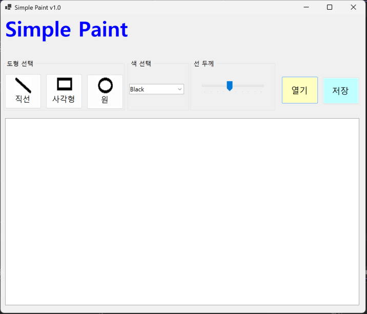

# (C# 코딩) 그림판
## 개요
- C# 프로그래밍 학습
- 1줄 소개: 선, 사각형, 원을 선택하여 원하는 색상과 선 굵기로 그림을 그릴 수 있는 간단한 그림판 프로그램
- 사용한 플랫폼:
  - C#, .NET Windows Forms, Visual Studio, GitHub
- 사용한 컨트롤:
  - Label, Button, GroupBox, ComboBox, TrackBar, PictureBox
- 사용한 기술과 구현한 기능:
  -  Windows Forms를 이용한 그림판 UI 구성, 도형 선택 버튼 구성, 색상 선택 기능 구현, 선 굵기 조절 기능 구현,  PictureBox를 이용한 캔버스 영역 구성

## 실행 화면 (과제1)
- 코드의 실행 스크린샷과 구현 내용 설명

- 구현한 내용 (위 그림 참조)
 
  - SimplePaint 프로그램의 기본 UI 구성함
  - 프로그램 제목을 표시하는 Label 배치함
  - 도형 선택을 위한 Button 3개 배치함
  - 직선, 사각형, 원 버튼에 각각 이미지 적용함
  - 색상 선택을 위한 ComboBox 배치함
  - ComboBox에 Black, Red, Blue, Green 항목 추가함
  - 선 굵기 조절을 위한 TrackBar 배치함
  - 그림을 그릴 영역으로 PictureBox 배치함
  - 파일 열기와 저장 기능을 위한 Button 배치함
  - 버튼 클릭으로 현재 선택된 도형이 변경되도록 구현함
  - ComboBox 선택값에 따라 현재 색상이 변경되도록 구현함
  - TrackBar 값에 따라 선 굵기가 변경되도록 구현함

## 실행 화면 (과제2)
- 코드의 실행 스크린샷과 구현 내용 설명

- 구현한 내용
  - 마우스 드래그를 이용한 도형 그리기 기능 구현함
  - PictureBox 영역에서 마우스를 누르면 시작 좌표가 저장되도록 구현함
  - 마우스를 드래그하는 동안 현재 좌표가 계속 갱신되도록 구현함
  - 마우스를 떼면 시작 좌표와 끝 좌표를 기준으로 도형이 그려지도록 구현함
  - 선택된 도형에 따라 직선, 사각형, 원이 그려지도록 구현함
  - 선택된 색상과 선 굵기가 실제 도형에 적용되도록 구현함
  - Bitmap과 Graphics를 이용하여 그림이 캔버스에 저장되도록 구현함
  - Paint 이벤트를 이용하여 드래그 중인 도형이 미리 보이도록 구현함
  - Invalidate()를 사용하여 캔버스 화면이 다시 그려지도록 구현함